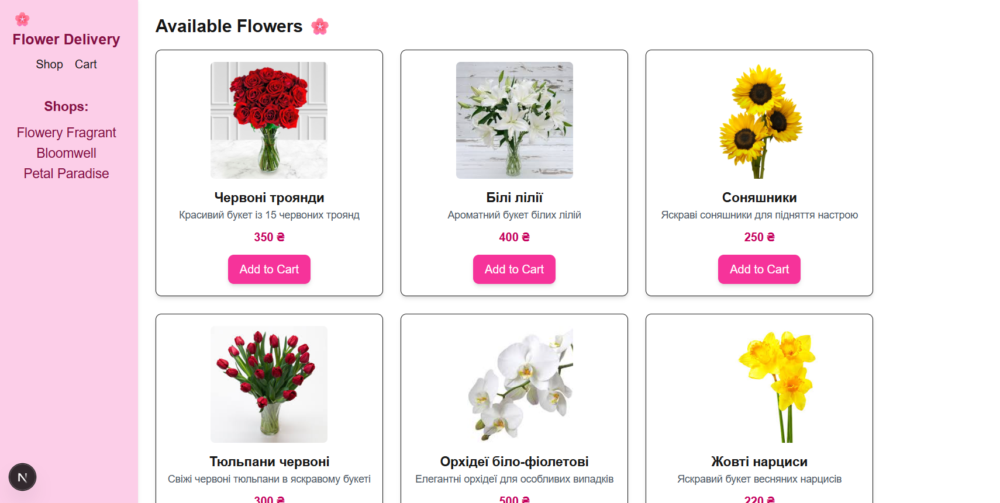

# Flower Delivery App 🌸

**Level:** Base (Failed to deploy on Vercel.)

This project is a basic online flower shop with a cart, ordering system, and shop pages.

## Technologies & Resources
- **Frontend:** Next.js 13 (App Router), React, TypeScript
- **Styling:** Tailwind CSS
- **State Management:** Context API for the cart
- **Database:** MongoDB Atlas
- **API:** Next.js API Routes
- **Icons:** react-icons
- **Images:** local images in the `public/images` folder

## Features
- Browse a list of shops and their flowers
- Add products to the cart
- Form validation for orders
- Submit orders to the server (MongoDB)
- Calculate the total cart amount

## Screenshot

GitHub Repo: Flower Delivery App

👩‍💻 Author: Juliia Pershina.

Developed as a test project to demonstrate a Fullstack (Next.js + Express + MongoDB) application.
